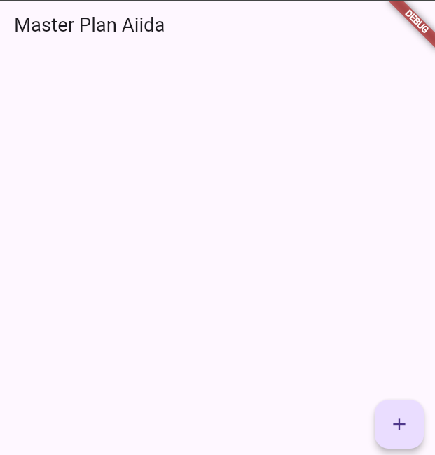
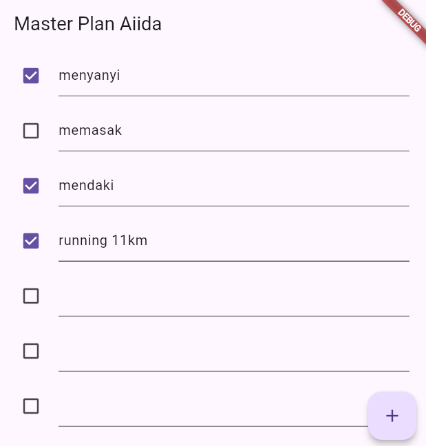
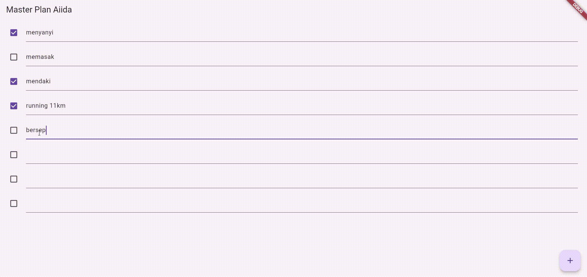
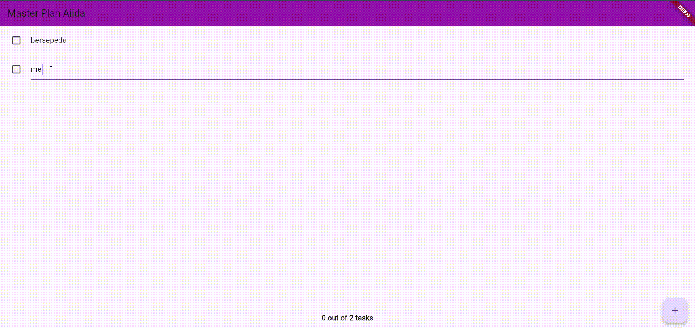
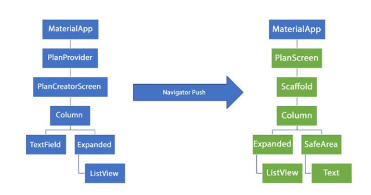
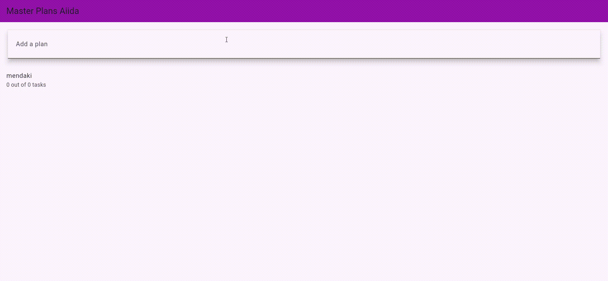

# master_plan

A new Flutter project for learning basic Flutter app structure and UI building.

## 📌 Getting Started

## 📷 Hasil Praktikum 1
 
 
Hasil awal sebelum tambah data

  
Hasil setelah tambah data

---

soal!
1. Jelaskan maksud dari langkah 4 pada praktikum tersebut!Mengapa dilakukan demikian?
2. Mengapa perlu variabel plan di langkah 6 pada praktikum tersebut? Mengapa dibuat konstanta ?
3. Lakukan capture hasil dari Langkah 9 berupa GIF, kemudian jelaskan apa yang telah Anda buat!
4. Apa kegunaan method pada Langkah 11 dan 13 dalam lifecyle state ?

Jawaban:
1. Langkah 4 dilakukan untuk mempermudah proses pengelolaan dan pemanggilan model dalam proyek. Dengan membuat satu file bernama data_layer.dart yang melakukan ekspor ulang terhadap plan.dart dan task.dart, kita tidak perlu lagi mengimpor kedua file tersebut satu per satu di berbagai bagian aplikasi. Pendekatan ini membantu menjaga struktur kode tetap bersih dan menghindari import yang berulang, terutama saat jumlah file model semakin banyak.

2. Variabel plan di Langkah 6 & Alasan Dijadikan const, plan digunakan sebagai penyimpanan utama data rencana yang sedang aktif. Nilai awal dibuat const karena objek awal tidak berubah sampai widget memperbarui state-nya, sehingga data lebih stabil dan terstruktur.

3. Hasil Langkah 9 (GIF)

4. Kegunaan initState() dan dispose() (Langkah 11 & 13)
initState() untuk inisialisasi awal widget, seperti menyiapkan data atau listener.
dispose() untuk membersihkan resource ketika widget dihapus, seperti menghentikan controller atau listener.

---

## 📷 Hasil Praktikum 2

Soal!

Jelaskan mana yang dimaksud InheritedWidget pada langkah 1 tersebut! Mengapa yang digunakan InheritedNotifier?
Jelaskan maksud dari method di langkah 3 pada praktikum tersebut! Mengapa dilakukan demikian?
Lakukan capture hasil dari Langkah 9 berupa GIF, kemudian jelaskan apa yang telah Anda buat!

Jawaban:
1. Kita memakai InheritedNotifier karena widget bisa menerima pembaruan data secara otomatis setiap kali nilai dalam ValueNotifier<Plan> berubah. Dengan cara ini, tampilan UI akan langsung ter-update tanpa perlu memanggil setState() pada setiap perubahan data, sehingga alur data menjadi lebih rapi dan terpusat.

2. Getter completedCount berfungsi menghitung berapa banyak tugas yang sudah ditandai selesai. Caranya dengan menyaring daftar tasks berdasarkan nilai task.complete yang bernilai true, lalu mengambil totalnya. Sementara itu, getter completenessMessage dipakai untuk menghasilkan teks ringkasan perkembangan. Pesan ini menampilkan informasi seperti “3 out of 5 tasks”, sehingga pengguna dapat melihat jumlah tugas selesai dibanding total tugas yang ada.

3. Hasil (GIF)

## 📷 Hasil Praktikum 3

Soal!

1. Berdasarkan Praktikum 3 yang telah Anda lakukan, jelaskan maksud dari gambar diagram berikut ini!
  

2. Lakukan capture hasil dari Langkah 14 berupa GIF, kemudian jelaskan apa yang telah Anda buat!

Jawaban:

1.  Diagram tersebut menunjukkan alur navigasi dan struktur widget aplikasi Master Plan pada Praktikum 3. Bagian kiri menggambarkan halaman awal PlanCreatorScreen, yang terdiri dari MaterialApp → PlanProvider → PlanCreatorScreen → Column berisi TextField untuk menambah plan dan Expanded + ListView untuk menampilkan daftar plan. Sedangkan Bagian kanan menunjukkan PlanScreen, yaitu halaman detail yang muncul setelah pengguna memilih sebuah plan melalui Navigator.push(). Struktur widgetnya terdiri dari MaterialApp → Scaffold → Column dengan Expanded (ListView tugas) dan SafeArea (teks progres).

2. Praktikum 3 sendiri menekankan penggunaan state management yang lebih maju dengan InheritedNotifier dan ValueNotifier, sehingga data seperti daftar plan dan task dapat diakses dan diperbarui antar beberapa widget tanpa harus terus menerus mengoper data melalui konstruktor.

